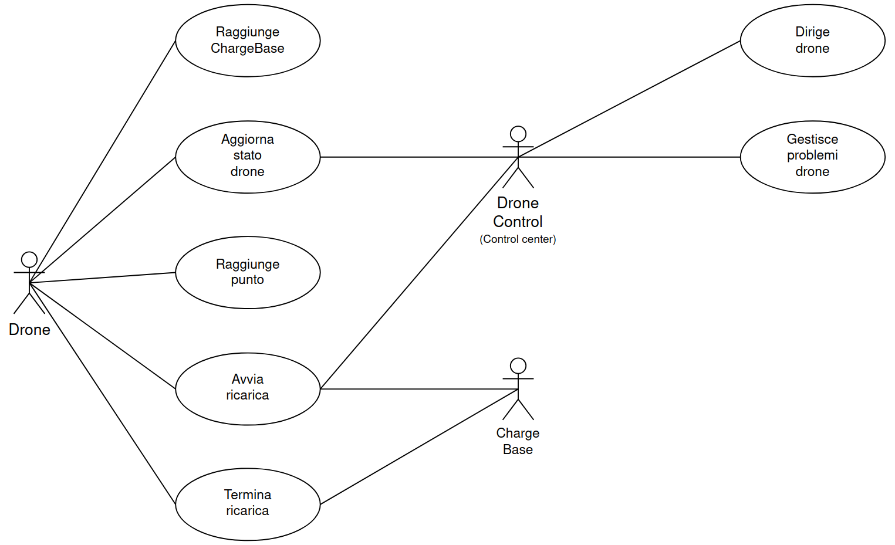

# Drone Control System

## Indice

- [Drone Control System](#drone-control-system)
  - [Indice](#indice)
- [Descrizione generale](#descrizione-generale)
  - [Fini del sistema](#fini-del-sistema)
  - [Modello concettuale ed illustrazione del sistema](#modello-concettuale-ed-illustrazione-del-sistema)
    - [Modello concettuale del sistema](#modello-concettuale-del-sistema)
    - [Struttura dell'area sorvegliata](#struttura-dellarea-sorvegliata)
    - [Stati del sistema](#stati-del-sistema)
    - [Stati di guasto dei droni](#stati-di-guasto-dei-droni)
    - [Visualizzare il sistema](#visualizzare-il-sistema)
      - [Area da sorvegliare](#area-da-sorvegliare)
      - [To starting line](#to-starting-line)
      - [Working](#working)
      - [To base](#to-base)
- [User requirements](#user-requirements)
  - [Use case utente](#use-case-utente)
    - [Use case vista ampia del sistema](#use-case-vista-ampia-del-sistema)
- [System requirements](#system-requirements)
  - [Architectural system diagram](#architectural-system-diagram)
  - [Activity diagram creazione Wave e droni](#activity-diagram-creazione-wave-e-droni)
  - [State diagram Drone](#state-diagram-drone)
  - [Message sequence chart diagram carica Drone](#message-sequence-chart-diagram-carica-drone)
- [Implementation](#implementation)
  - [Implementazione software](#implementazione-software)
  - [_Outsourcing_](#outsourcing)
  - [Implementare il sistema](#implementare-il-sistema)
    - [Componente ChargeBase](#componente-chargebase)
    - [Componente DroneManager](#componente-dronemanager)
    - [Componente DroneControl](#componente-dronecontrol)
    - [Componente Drone](#componente-drone)
    - [Componente DroneZone](#componente-dronezone)
    - [Componente Buffer](#componente-buffer)
    - [Componente Globals](#componente-globals)
  - [Database e Redis](#database-e-redis)
    - [Schema del Database](#schema-del-database)
      - [Connessione al Database](#connessione-al-database)
      - [Definizione dello Schema della Tabella](#definizione-dello-schema-della-tabella)
      - [Gestione delle Modifiche e Aggiornamenti](#gestione-delle-modifiche-e-aggiornamenti)
    - [Connessioni Redis](#connessioni-redis)
  - [Risultati Sperimentali](#risultati-sperimentali)

## Drone Control System

Drone Control System è un progetto simulante un sistema di sorveglianza basato su droni volanti che monitorano un'area
di $6\times6\,\mathrm{Km}$.

Il sistema è sviluppato come progetto d'esame
per [Ingegneria del software](https://corsidilaurea.uniroma1.it/it/view-course-details/2023/29923/20190322090929/1c0d2a0e-d989-463c-a09a-00b823557edd/8e637351-4a3a-47a1-ab11-dfe4ad47e446/4f7bd2b2-2f8e-4c38-b15f-7f3c310550b6/8bcc378c-9ff1-4263-87b7-04a394485a9f?guid_cv=8e637351-4a3a-47a1-ab11-dfe4ad47e446&current_erogata=1c0d2a0e-d989-463c-a09a-00b823557edd),
corso tenuto dal prof [Enrico Tronci](https://corsidilaurea.uniroma1.it/it/users/enricotronciuniroma1it)
a [La Sapienza](https://www.uniroma1.it/), ed è basato sul progetto gentilmente proposto dal prof nel
main.pdf [qui](https://drive.google.com/drive/folders/15HrKGosqsuBBe8qWCm1qB_PvIbRLohqZ), al punto _4.2 Controllo
formazione droni_.

## Descrizione generale

### Fini del sistema

Il sistema progettato è basato, come detto in apertura, su una delle tracce di progetto fornite dal prof Tronci. La
traccia è la seguente:

> Si progetti il centro di controllo per una formazione di droni che deve sorvegliare un'area di dati. Ogni drone ha
> un'autonomia di $30$ minuti di volo ed impiega un tempo di minimo $2h$ e massimo $3h$ per ricaricarsi. Il tempo di
> ricarica è scelto ad ogni ricarica uniformemente a random nell'intervallo $[2h, 3h]$. Ogni drone si muove alla
> velocità
> di $30 Km/h$. L’area da monitorare misura $6\times6$ Km. Il centro di controllo e ricarica si trova al centro
> dell’area
> da sorvegliare. Il centro di controllo manda istruzioni ai droni in modo da garantire che per ogni punto dell’area
> sorvegliata sia verificato almeno ogni $5$ minuti. Un punto è verificato al tempo $t$ se al tempo $t$ c'è almeno un
> drone a distanza inferiore a $10$ m dal punto. Il progetto deve includere i seguenti componenti:
>
> 1. Un modello (test generator) per i droni
> 2. Un modello per il centro di controllo
> 3. Un DB per i dati (ad esempio, stato di carica dei droni) ed i log
> 4. Monitors per almeno tre proprietà funzionali
> 5. Monitors per almeno due proprietà non-funzionali

Il sistema si occupa quindi di verificare che ogni punto dell'area sia sorvegliato ogni cinque minuti, e, in caso
contrario, segnala eventuali anomalie.

### Modello concettuale ed illustrazione del sistema

#### Modello concettuale del sistema

Il sistema si compone di una **base centrale** (composta da componenti come **ChargeBase**, **DroneControl**, **Scanner**) situata al centro dell'area, che funge da punto di partenza e ricarica per i droni.  
La **ChargeBase** è l'unico punto dell'intera area in cui i droni si trovano in uno stato di **non volo** e gestisce la ricarica di ciascun drone dopo ciascun suo giro di perlustrazione. Più precisamente gli stati di non volo sono due, ossia `CHARGING` e `IDLE`, e il giro di perlustrazione corrisponde allo stato di `WORKING` del drone. Per spiegare come ogni drone adempie alla verifica di ogni punto ogni cinque minuti almeno, vediamo come l'area è concettualmente strutturata.

#### Struttura dell'area sorvegliata

L'area da sorvegliare è un quadrato di $6x6\mathrm{\,Km}$ $(36 \mathrm{\, Km^2})$, suddiviso in una griglia regolare composta da quadrati di lato $20\mathrm{m}$ ciascuno. La griglia ha quindi $300$ righe e $300$ colonne, ed un totale di $90.000$ quadrati.

Partendo dalla richiesta della traccia abbiamo pensato di vedere questi quadrati come delle _celle_ con al proprio centro il punto da verificare per il drone. Quest'ultimo condivide infatti l'istante di tempo $t$ in cui è coperto con ogni altro punto nella cella, facendo sì che al passaggio del drone sul punto al $t$-esimo istante di tempo, l'intera area del quadrato della griglia risulti simultaneamente coperta - dove il tempo è rappresentato, nel nostro sistema, da un'unità di tempo chiamata `tick` (un tick equivale ad un numero preciso di secondi che vedremo dopo).  
Possiamo pensare a questa operazione di copertura come ad una scansione wireless dell'area della cella (da parte del drone) della portata di al più $(28,28)/2=14,14 \mathrm{\, m}$ a partire dal centro del quadrato, che è il punto su cui il drone transita durante lo stato di `WORKING`.
Nel nostro sistema lo scorrere del tempo è reso da un while che

Dando seguito a quanto detto, sul lato sinistro dell'area (ci riferiamo con _area_ all'area $6x6\mathrm{\,Km}$, e con _quadrato_/_cella_ ai quadrati di lato $20 \mathrm{m}$ inscritti al suo interno), abbiamo, per ogni quadrato un drone pronto a partire. Difatti il lato di sinistra dell'area è detto `starting_line`, ed è il punto da cui i droni partono per verificare i punti. Prima che ciò avvenga, ci sono alcuni altri stati per cui l sistema passa. Vediamoli meglio di seguito.

#### Stati del sistema

Facciamo ordine circa gli stati del sistema:

1. **Avvio simulazione (`CHARGING`)**  
   Avviata la simulazione, $300$ droni vengono generati al centro dell'area nello stato di `CHARGING`.

2. **Attesa in base (`IDLE`)**  
   I droni che raggiungono la carica massima non partono di lora spontee e/o subitaneamente verso la `starting_line`, ma attendono per un tempo imprecisato che il sistema (nelle vesti della componente Scanner) li scelga individualmente per la partenza, passando durante questa fase da `CHARGING`ad `IDLE`. Un drone in `IDLE` non svolge alcuna attività particolare eccetto quella di attendere di esser scelto per dirigersi alla `starting_line`.

3. **Partenza droni (`TO_STARTING_LINE`)**  
   Carichi al $100\%$, i droni scelti da Scanner partono dalla `ChargeBase` verso il lato sinistro dell'area, per posizionarsi lungo una linea di partenza, la suddetta `starting_line`. Ogni drone si disporrà a metà del lato sinistro di uno dei quadrati adiacenti la linea di partenza. Avremo perciò $300$ droni pronti a partire dal lato sinistro dell'area, uno per ogni quadrato.
   Durante questo spostamento, la maggior parte dei droni si muove **in diagonale** per raggiungere la propria posizione sulla linea di partenza, a eccezione di quelli che già si trovano sull'asse centrale.

4. **Pre-partenza (`READY`)**  
   I droni giunti alla `starting_line` non passano subito a `WORKING`, ma entrano in uno stato di attesa chiamato `READY`, in cui rimangono fin quando ognuno dei $300$ droni non è arrivato alla `starting_line` ed è passato a sua volta a `READY`.

5. **Copertura dell'area (`WORKING`)**  
   Dopo che tutti i droni sono entrati in `READY`, essi entrano contemporaneamente nello stato di `WORKING`. Iniziano quindi il loro volo a $30 Km/h$ in linea retta (parallela alla base dell'area) verso il lato destro del perimetro dell'area.  
   Mentre è in `WORKING`, un drone non fa altro che percorrere nel modo appena detto, passando sopra ciascun punto al centro dei 300 quadrati che separano la `starting_line` dal lato destro dell'area. Ogni volta che un drone sorvola un punto, lo verifica, verificando al contempo tutta l'area del quadrato di cui il punto è il centro.
   Per far sì che il requisito di sorveglianza di ogni punto almeno ogni $5$ minuti sia rispettato, una nuova ondata (o onda) di droni parte non appena l'attuale ha percorso per tale tempo l'area da sinistra a destra, laddove con ondata s'intende la "colonna", linea verticale di $300$ droni parallela ai lati verticali dell'area. Logicamente, per far sì che ciò accada, l'onda di droni che parte scoccati cinque minuti dallo stato di `WORKING`, viene fatta partire prima e per tempo dalla ChargeBase alla volta della `starting_line`. Si noti che formalmente le onde di droni (nel SUD afferenti al componente Wave) vengono fatte partire ogni $5$ minuti, dove i minuti sono misurati coi tick a cui prima si faceva cenno.  
   In questo modo, con onde di droni partenti ogni cinque minuti dalla `starting_line`, ogni punto dell'area è verificato sicuramente almeno ogni cinque minuti: quando un punto sulla linea di quadrati che il drone percorre sarà stato verificato, esso lo sarà di nuovo entro i prossimi cinque minuti grazie al drone della nuova onda che arriverà a sorvegliarlo trascorso il tempo detto.
   Questo sistema forma un meccanismo ad onde che è possibile vedere nelle immagini a seguire, in cui nel lifetime di una simulazione è possibile osservare il susseguirsi di diverse onde di droni, ciascuna delle quali copre naturalmente per intero l'area da sinistra a destra.

6. **Ritorno alla base (`TO_BASE`)**  
   Quando un drone/onda (possiamo usare i termini in maniera intercambiabile, perché il movimento di un drone è equivalente a quello di un'onda) raggiunge il lato destro dell'area, termina il suo lavoro di verifica dei punti copertura dell'area, e passa allo stato `TO_BASE`. In questo stato non fa altro che tornare verso il **centro** dell'area per ricaricarsi, ed essere riutilizzato in un nuovo viaggio di copertura.
   Come nella fase di partenza, i droni che si trovano lontani dall'_asse centrale_ si muovono **diagonalmente** per raggiungere il centro, mentre quelli allineati proseguono in linea retta.

#### Stati di guasto dei droni

Durante uno qualsiasi degli stati di volo (`TO_STARTING_LINE`, `READY`, `WORKING`, `TO_BASE`), i droni possono entrare in uno dei seguenti fault state:

- **EXPLODED**: Il drone subisce un malfunzionamento critico e diventa irrecuperabile.
- **DISCONNECTED**: Il drone perde la connessione e tenta di riconnettersi.
- **HIGH_CONSUMPTION**: Il drone consuma più del previsto e continua a operare fino a quando la carica non si esaurisce.

I droni con stato `DISCONNECTED` possono recuperare la connessione (`RECONNECTED`) tornando quindi allo stato precedente la disconnessione, oppure passare a `DEAD` se la connessione non viene ristabilita. I droni negli stati `EXPLODED`, e `HIGH_CONSUMPTION` finiscono invece sempre nello stato `DEAD`.

Si noti che `HIGH_CONSUMPTION` è un "meta-stato", se vogliamo. Infatti nel SUD non compare come uno stato vero e proprio (gli altri, ad esempio, sì, essendo definiti in classi apposite), ma è semplicemente una condizione del drone in uno stato di volo che vede il proprio consumo moltiplicato di un fattore casuale scelto in un range di valori plausibile per uno stato di alto consumo di energia.

Ogni fault state è conseguenza di uno scenario attivato dal TestGenerator, che è l'entità adibita alla generazione tramite generatori pseudocasuali di avvenimenti riguardanti l'intero DroneControlSystem.

#### Visualizzare il sistema

La seguente è una vista ad alto livello dell'area, delle componenti del sistema e di alcune delle fasi in cui sono coinvolte

##### Area da sorvegliare


##### To starting line


##### Working


##### To base


##### Contesto del sistema

![[Contesto del sistema]](../res/cntxt_view.png)

## User requirements

Questi sono i requisiti utente che riflettono le esigenze e le aspettative degli utenti del sistema:

- **(1) Area di Sorveglianza**: L’area da monitorare misura $6\times6$ Km.
- **(2) Centro di Controllo e Ricarica**: Il centro di controllo e ricarica si trova al centro dell’area da sorvegliare.
- **(3) Autonomia e ricarica dei droni**: ogni drone ha $30$ minuti di autonomia e deve ricaricarsi in un tempo compreso
  tra le $[2, 3]$ ore

### Use case utente

#### Use case vista ampia del sistema



## System requirements

Questi requisiti sono i requisiti di sistema che dettagliano le specifiche tecniche e le funzionalità necessarie per implementare il sistema:

- **(1.1) Sistema di Copertura dell'Area di Sorveglianza**: Il sistema deve programmare e coordinare i percorsi di volo
  dei droni per garantire una copertura completa e costante dell'area di sorveglianza di $6\times6$ Km.
- **(1.2) Monitoraggio e Verifica del Territorio**: Il sistema deve assicurare che ogni punto dell'area sia verificato
  almeno una volta ogni $5$ minuti, monitorando la posizione e l'attività di ciascun drone.
  Un punto è verificato al tempo $t$ se al tempo $t$ c'è almeno un drone a distanza inferiore a $10$ m dal punto
- **(2.1) Implementazione del Centro di Controllo**: Il centro di controllo e ricarica deve essere fisicamente situato
  al centro dell'area da sorvegliare. Il sistema deve essere configurato per utilizzare questa posizione centrale come
  punto di partenza per la pianificazione delle missioni e per l'ottimizzazione dei percorsi di ritorno per la ricarica.
- **(2.2) Funzionalità del Centro di Controllo**: Il centro di controllo, situato al centro dell'area di sorveglianza,
  deve gestire tutte le operazioni dei droni, inclusa la pianificazione delle missioni, il monitoraggio in tempo reale e
  la gestione delle emergenze.
- **(3.1) Controllo autonomia dei Droni**: Il sistema deve gestire autonomamente l'autonomia di volo di ciascun drone,
  coordinando i tempi di rientro per la ricarica basandosi sul livello di carica della batteria.

### Architectural system diagram


### Activity diagram creazione Wave e droni


### State diagram Drone


### Message sequence chart diagram carica Drone


## Implementation

### Implementazione software

Il sistema è implementato in [C++](https://isocpp.org/), e fa uso di [Redis](https://redis.io/) e
di [PostgreSQL](https://www.postgresql.org/).
Redis è disponibile in C++ come client grazie a [redis-plus-plus](https://github.com/sewenew/redis-plus-plus), ed è
quello che è stato usato.
Redis è stato usato per gestire i flussi di dati dei thread, compresi quelli dei droni, e per la comunicazione col
database PostgreSQL.

### _Outsourcing_

Nell'implementazione del sistema abbiamo cionondimeno considerato l'uso di altre tecnologie di cui esso è altresì composto, quali quelle del:

- sistema di comunicazione wireless droni⇒centro di controllo (e vva.): per trasmettere dati e conferme tra droni e centro di controllo
- sistema GPS: per determinare con precisione la posizione del drone e muoverlo nell'area

Sebbene alcune di queste tecnologie e componenti siano usate nel sistema (come il GPS), la loro implementazione è esterna e relegata a misure di outsourcing.

### Implementare il sistema

Il sistema è strutturato secondo un'architettura modulare che comprende diverse componenti chiave, ciascuna realizzata
attraverso file sorgente specifici.

#### Componente ChargeBase

Questa componente è responsabile per la gestione della ricarica dei droni. Tramite una classe Singleton, `ChargeBase`
controlla il ciclo di ricarica, assicurando che i droni siano pronti per le operazioni di volo secondo le necessità del
sistema.

_Pseudocodice di ChargeBase:_

```
class ChargeBase
    // Variabili private per il controllo della ricarica
    engine: generatore di numeri casuali
    redis: connessione a Redis
    charging_drones: mappa degli droni in carica

    ChargeBase(redis):
        Inizializza il generatore di numeri casuali
        Imposta la connessione a Redis

    ChargeDrone():
        Seleziona un drone dalla coda di ricarica
        Calcola un tempo di ricarica casuale tra 2 e 3 ore
        Aggiorna lo stato di ricarica del drone

    releaseDrone(drone):
        Aggiorna lo stato del drone a "caricato"
        Invia il comando di rilascio al drone

    Run():
        Loop infinito che gestisce le richieste di ricarica e rilascio
```

#### Componente DroneManager

Il `DroneManager` coordina le operazioni della flotta di droni, gestendo lo stato di ciascun drone e distribuendo i
compiti di sorveglianza.

_Pseudocodice di DroneManager:_

```
class DroneManager
    // Variabili private per il tracking dei droni
    active_drones: elenco dei droni attivi
    redis: connessione a Redis

    DroneManager(redis):
        Inizializza la lista dei droni attivi
        Imposta la connessione a Redis

    LaunchDrone():
        Seleziona un drone carico e disponibile
        Invia il comando di decollo e sorveglianza

    MonitorArea():
        Monitora costantemente che l'area sia sorvegliata
        Assegna i droni alle zone non coperte

    RetrieveDrone(drone):
        Comanda al drone di ritornare alla base per la ricarica
```

#### Componente DroneControl

Il modulo `DroneControl` si occupa di impartire le istruzioni operative ai droni, garantendo che ogni area sia
monitorata in conformità con i requisiti di progetto.

_Pseudocodice di DroneControl:_

```
class DroneControl
    // Variabili per il controllo dei droni
    redis: connessione a Redis
    control_strategy: strategia di controllo dei droni

    DroneControl(redis):
        Imposta la connessione a Redis
        Definisce la strategia di controllo

    SendInstructions(drone):
        Determina il percorso ottimale per il drone
        Invia istruzioni dettagliate al drone per la sorveglianza

    HandleEvent(event):
        Gestisce eventi imprevisti modificando la strategia di controllo
```

#### Componente Drone

Il `Drone` è l'entità fondamentale del sistema, dotata di funzionalità per il volo autonomo e la sorveglianza. Ogni
drone ha un'autonomia limitata e necessita di ricarica dopo un periodo di attività.

_Pseudocodice di Drone:_

```
class Drone
    // Stato e informazioni del drone
    id: identificativo unico
    status: stato attuale del drone
    position: posizione corrente
    autonomy: autonomia residua
    redis: connessione a Redis

    Drone(redis, id, position):
        Imposta l'identificativo e la posizione iniziale
        Connette al sistema Redis
        Inizializza l'autonomia

    UpdateStatus():
        Aggiorna lo stato del drone in base a volo o ricarica

    PerformSurveillanceTask(task):
        Esegue un compito di sorveglianza assegnato
        Aggiorna la posizione e l'autonomia durante il volo

    ReturnToChargeBase():
        Se l'autonomia è sotto la soglia critica, ritorna alla base
```

#### Componente DroneZone

Il modulo `DroneZone` divide l'area di sorveglianza in zone assegnate ai droni per ottimizzare la copertura dell'area e
garantire il monitoraggio secondo i requisiti.

_Pseudocodice di DroneZone:_

```
class DroneZone
    // Informazioni sulla zona di sorveglianza
    id: identificativo unico della zona
    drones: elenco dei droni assegnati
    surveillance_strategy: strategia di sorveglianza per la zona

    DroneZone(id):
        Imposta l'identificativo della zona
        Inizializza la lista dei droni e la strategia di sorveglianza

    AssignDrone(drone):
        Assegna un drone alla zona per la sorveglianza

    UpdateSurveillanceStrategy():
        Aggiorna la strategia di sorveglianza in base alle necessità
```

#### Componente Buffer

`Buffer.hpp` è un template utilizzato per la gestione dei dati condivisi tra le componenti del sistema, garantendo il
corretto trasferimento di informazioni tra i moduli senza corruzione dei dati.

_Pseudocodice di Buffer:_

```
template <typename T>
class Buffer
    // Buffer per dati di tipo T
    buffer: coda protetta per dati di tipo T

    Push(data):
        Aggiunge dati al buffer in maniera thread-safe

    Pop():
        Rimuove e ritorna i dati dal buffer in maniera thread-safe
```

#### Componente Globals

I file `globals.h` e `globals.cpp` definiscono variabili, costanti e funzioni ausiliarie utilizzate in più parti del
sistema per facilitare l'accesso a informazioni comuni e ridurre la duplicazione del codice.

_Pseudocodice di Globals:_

```
// Definizioni globali e funzioni comuni
Define MAX_DRONE_AUTONOMY
Define CHARGE_BASE_LOCATION

Function GenerateUniqueId():
    Restituisce un ID unico per i nuovi droni

Function CalculateDistance(point1, point2):
    Calcola la distanza tra due punti
```

#### Database e Redis

Le operazioni di lettura e scrittura nei log e nel tracciamento dello stato dei droni vengono gestite attraverso il
modulo `Database`, che si interfaccia con PostgreSQL, e Redis, che fornisce un sistema di coda e comunicazione in tempo
reale.

_Pseudocodice del Database:_

```
class Database
    // Variabili per l'interfaccia del database
    connection: connessione al database PostgreSQL

    Database(connection_info):
        Inizializza la connessione al database

    LogEvent(event):
        Registra l'evento nel database

    UpdateDroneStatus(drone):
        Aggiorna lo stato del drone

 nel database
```

_Pseudocodice di Redis (semplificato per l'uso nel progetto):_

```
Connetti a Redis:
    Inizializza la connessione a Redis
    Configura i canali di comunicazione per i droni

Pubblica Messaggi:
    Invia comandi ai droni tramite Redis

Sottoscrivi a Canali:
    Ascolta i feedback dei droni e aggiorna il sistema
```

### Schema del Database

Analizziamo ora lo schema del database. Questo ci permetterà di fornire una descrizione dettagliata di come i dati
vengono memorizzati.

Drone Control System utilizza un database PostgreSQL per memorizzare e gestire i dati relativi all'attività e allo stato
dei droni durante le missioni di sorveglianza. La gestione del database è implementata nel file `Database.cpp`,
specificamente nella funzione `get_DB()`, che si occupa di stabilire la connessione al database e di configurare lo
schema necessario.

#### Connessione al Database

La funzione inizia con la verifica dell'esistenza del database denominato 'dcs'. Se il database non è presente, viene
creato utilizzando le credenziali standard:

```cpp
pqxx::connection C("user=postgres password=admin@123 hostaddr=127.0.0.1 port=5432");
pqxx::nontransaction N(C);
pqxx::result R = N.exec("SELECT 1 FROM pg_database WHERE datname='dcs'");
if (R.empty()) {
    pqxx::work W(C);
    W.exec("CREATE DATABASE dcs");
    W.commit();
}
```

User e password sono ovviamente personalizzabili a discrezione dell'utente del sistema.

Una volta assicurata l'esistenza del database, si procede con la connessione specifica al database 'dcs' per iniziare le
operazioni di gestione dei dati.

#### Definizione dello Schema della Tabella

La tabella principale utilizzata per registrare i dati dei droni è `drone_logs`. Questa tabella viene definita come
segue:

```sql
CREATE TABLE drone_logs (
    tick_n INT,
    drone_id INT NOT NULL,
    status VARCHAR(255),
    charge FLOAT,
    zone VARCHAR(255),  // TODO: Change to int
    x FLOAT,
    y FLOAT,
    checked BOOLEAN,
    CONSTRAINT PK_drone_logs PRIMARY KEY (tick_n, drone_id)
);
```

Questo schema è progettato per registrare informazioni dettagliate per ogni "tick" della simulazione, ovvero ogni unità
di tempo in cui il sistema verifica e aggiorna lo stato dei droni. I campi includono:

- `tick_n`: il numero del tick di simulazione.
- `drone_id`: un identificativo univoco per il drone.
- `status`: lo stato attuale del drone, come "in volo", "in ricarica", etc.
- `charge`: la percentuale di carica rimanente della batteria del drone.
- `zone`: la zona di sorveglianza assegnata al drone.
- `x` e `y`: le coordinate correnti del drone nella zona di sorveglianza.
- `checked`: un booleano che indica se il drone ha verificato un punto specifico nel suo ultimo tick.

#### Gestione delle Modifiche e Aggiornamenti

Se la connessione al database è stata stabilita con successo, la tabella `drone_logs` viene sovrascritta ad ogni avvio
del sistema per garantire che i dati riflettano l'ultimo schema desiderato. Questo approccio permette di aggiornare
facilmente lo schema se necessario per future estensioni o modifiche al sistema.

---

### Connessioni Redis

Le connessioni e le operazioni Redis sono fondamentali per la comunicazione asincrona all'interno del progetto. Il
codice relativo si trova in `ChargeBase.cpp`, `DroneManager.cpp`, e `DroneControl.cpp`, dove è possibile osservare l'uso
pratico dei canali Redis, delle sottoscrizioni e delle pubblicazioni di messaggi.  
La struttura del database e le tabelle sono gestite direttamente tramite query SQL all'interno del codice del progetto,
come si evince dalle richieste di tipo `DatabaseRequest` che includono una query SQL come stringa.  
La classe `Database` fornisce un'interfaccia asincrona per aggiungere richieste di database a un buffer, che poi vengono
processate da un thread dedicato. Questo approccio è utile per ridurre il carico e i tempi di attesa sul thread
principale del programma.

Le operazioni con Redis sono integrate in diverse parti del codice sorgente. Ecco alcuni esempi, nei vari file, delle
operazioni Redis usate:

**DroneControl.cpp:**

- Sincronizzazione con il server Redis utilizzando `utils::SyncWait(redis)`.
- Recupero e verifica dello stato della simulazione tramite `redis.get("sim_running")`.
- Lettura dello stream dei dati per gli aggiornamenti dei droni con `redis.command("XLEN", "drone_stream")`.

**DroneManager.cpp:**

- Attesa sincrona per il Redis server con `utils::SyncWait(shared_redis)`.
- Controllo dello stato della simulazione con `shared_redis.get("sim_running")`.
- Gestione delle zone con comandi come `shared_redis.scard("zones_to_swap")` e `shared_redis.spop("zones_to_swap")`.

**ChargeBase.cpp:**

- Recupero di un'istanza singleton di `ChargeBase` con un riferimento Redis passato al costruttore.
- Verifica dello stato della simulazione con `redis.get("sim_running")`.
- Monitoraggio dello stream di carica con `redis.command("XLEN", "charge_stream")`.
- Lettura e trimming degli stream Redis con comandi come `redis.xread` e `redis.command("XTRIM", ...)`.
- Aggiornamento dello stato del drone nella hash Redis con
  `redis.hset("drone:" + data[0].second, "status", "CHARGING")`.

Quindi, Redis viene utilizzato per mantenere una comunicazione costante tra il centro di controllo e i droni, oltre che
per registrare e recuperare i dati di stato necessari al funzionamento del sistema.

### Risultati Sperimentali

Descrivere i risultati ottenuti dalla simulazione del sistema.
