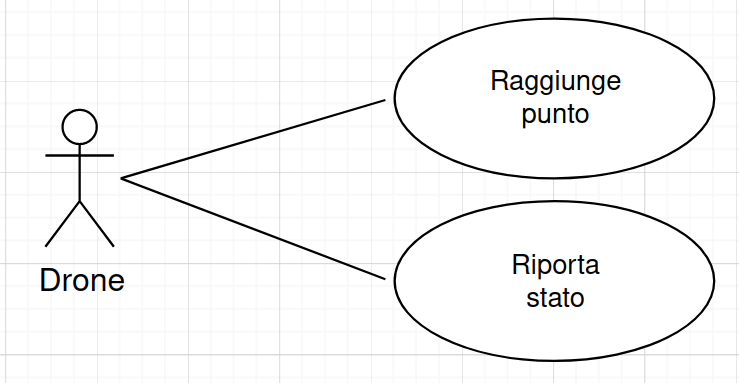
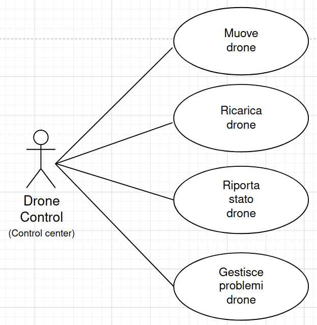

# Drone Control System

## Indice

- [Drone Control System](#drone-control-system)
- [Descrizione generale](#descrizione-generale)
  - [Di cosa si occupa Drone Control System](#di-cosa-si-occupa-drone-control-system)
  - [Fini del sistema](#fini-del-sistema)
  - [Schema del sistema](#schema-del-sistema)
    - [Area da sorvegliare](#area-da-sorvegliare)
    - [Contesto del sistema](#contesto-del-sistema)
- [User requirements](#user-requirements)
  - [Use case utente](#use-case-utente)
- [System requirements](#system-requirements)
  - [Use case di sistema](#use-case-di-sistema)
- [Implementation](#implementation)
  - [Implementazione software](#implementazione-software)
  - [Struttura dell'area sorvegliata](#struttura-dellarea-sorvegliata)
  - [Droni e verifica dei punti](#droni-e-verifica-dei-punti)
  - [Outsourcing](#outsourcing)
- [Risultati Sperimentali](#risultati-sperimentali)

## Drone Control System

Drone Control System è un progetto simulante un sistema di sorveglianza basato su droni volanti che monitorano un'area di $6\times6\,\mathrm{Km}$.

Il sistema è sviluppato come progetto d'esame per [Ingegneria del software](https://corsidilaurea.uniroma1.it/it/view-course-details/2023/29923/20190322090929/1c0d2a0e-d989-463c-a09a-00b823557edd/8e637351-4a3a-47a1-ab11-dfe4ad47e446/4f7bd2b2-2f8e-4c38-b15f-7f3c310550b6/8bcc378c-9ff1-4263-87b7-04a394485a9f?guid_cv=8e637351-4a3a-47a1-ab11-dfe4ad47e446&current_erogata=1c0d2a0e-d989-463c-a09a-00b823557edd), corso tenuto dal prof [Enrico Tronci](https://corsidilaurea.uniroma1.it/it/users/enricotronciuniroma1it) a [La Sapienza](https://www.uniroma1.it/), ed è basato sul progetto gentilmente proposto dal prof nel main.pdf [qui](https://drive.google.com/drive/folders/15HrKGosqsuBBe8qWCm1qB_PvIbRLohqZ), al punto _4.2 Controllo formazione droni_.

## Descrizione generale

### Di cosa si occupa Drone Control System

Il sistema progettato è basato, come detto in apertura, su una delle tracce di progetto fornite dal prof Tronci. La traccia è la seguente:

> Si progetti il centro di controllo per una formazione di droni che deve sorvegliare un'area di dati. Ogni drone ha un'autonomia di $30$ minuti di volo ed impiega un tempo di minimo $2h$ e massimo $3h$ per ricaricarsi. Il tempo di ricarica è scelto ad ogni ricarica uniformemente a random nell'intervallo $[2h, 3h]$. Ogni drone si muove alla velocità di $30 Km/h$. L’area da monitorare misura $6\times6$ Km. Il centro di controllo e ricarica si trova al centro dell’area da sorvegliare. Il centro di controllo manda istruzioni ai droni in modo da garantire che per ogni punto dell’area sorvegliata sia verificato almeno ogni $5$ minuti. Un punto è verificato al tempo $t$ se al tempo $t$ c'è almeno un drone a distanza inferiore a $10$ m dal punto. Il progetto deve includere i seguenti componenti:
>
> 1.  Un modello (test generator) per i droni
> 2.  Un modello per il centro di controllo
> 3.  Un DB per i dati (ad esempio, stato di carica dei droni) ed i log
> 4.  Monitors per almeno tre proprietà funzionali
> 5.  Monitors per almeno due proprietà non-funzionali

### Fini del sistema

Il sistema si occupa quindi di verificare che ogni punto dell'area sia sorvegliato ogni cinque minuti, e, in caso contrario, segnala eventuali anomalie. Difatti, e con precisione, se allo scoccare dell'ennesimo intervallo suddetto anche solo un punto dell'area non risulta come [checked](sap/crs/ing/checked), nel log del sistema verrà riportato lo stato di `check-failed` relativo a quel punto e all'annesso timestamp di verifica in cui si è verificato il mancato controllo.

### Schema del sistema

La seguente è una vista ad alto livello delle componenti del sistema

#### Area da sorvegliare

![[Area da sorvegliare]](../img/area_view.jpg)

#### Contesto del sistema

![[Contesto del sistema]](../img/cntxt_view.png)

## User requirements

Questi requisiti riflettono le esigenze e le aspettative degli utenti finali del sistema.

- **(1) Area di Sorveglianza**: L’area da monitorare misura $6\times6$ Km.
- **(2) Posizione del Centro di Controllo e Ricarica**: Il centro di controllo e ricarica si trova al centro dell’area da sorvegliare.
- **(3) Autonomia e ricarica dei droni**: ogni drone ha $30$ minuti di autonomia e deve ricaricarsi in un tempo compreso tra le $[2, 3]$ ore

### Use case utente

| Drone                      | Drone Control        |
| -------------------------- | -------------------- |
|  |  |

## System requirements

Questi requisiti dettagliano le specifiche tecniche e le funzionalità necessarie per implementare il sistema.

- **(1.1) Sistema di Copertura dell'Area di Sorveglianza**: Il sistema deve programmare e coordinare i percorsi di volo dei droni per garantire una copertura completa e costante dell'area di sorveglianza di $6\times6$ Km.
- **(1.2) Monitoraggio e Verifica del Territorio**: Il sistema deve assicurare che ogni punto dell'area sia verificato almeno una volta ogni $5$ minuti, monitorando la posizione e l'attività di ciascun drone.
  Un punto è verificato al tempo $t$ se al tempo $t$ c'è almeno un drone a distanza inferiore a $10$ m dal punto
- **(2.1) Progettazione e Implementazione del Centro di Controllo**: Il centro di controllo e ricarica deve essere fisicamente situato al centro dell'area da sorvegliare. Il sistema deve essere configurato per utilizzare questa posizione centrale come punto di partenza per la pianificazione delle missioni e per l'ottimizzazione dei percorsi di ritorno per la ricarica.
- **(2.2) Posizionamento e Funzionalità del Centro di Controllo**: Il centro di controllo, situato al centro dell'area di sorveglianza, deve gestire tutte le operazioni dei droni, inclusa la pianificazione delle missioni, il monitoraggio in tempo reale e la gestione delle emergenze.
- **(2.3) Interfaccia di Controllo e Comando**: Il sistema deve fornire un'interfaccia utente intuitiva e funzionale per permettere agli operatori di controllare e monitorare facilmente tutte le operazioni dei droni, e specie eventuali punti che essi non dovessero riuscire a sorvegliare
- **(3.1) Controllo autonomia dei Droni**: Il sistema deve gestire autonomamente l'autonomia di volo di ciascun drone, coordinando i tempi di rientro per la ricarica basandosi sul livello di carica della batteria.
- **(3.2) Ricambio Droni in volo**: Il sistema deve garantire la copertura dell'area assicurando che i droni scarichi vengano sostituiti per tempo e coordinatamente da altri droni che li rimpiazzino nello svolgimento della missione di verifica dei punti assegnativi.

### Use case di sistema

- Almeno un Activity Diagram UML per mostrare come le componenti del
  sistema concorrono ad soddisfare i requisiti utenti.
- Almeno uno State Diagram UML per una delle componenti del sistema.
- Almeno un Message Sequence Chart UML per la comunicazione tra le
  componenti del sistema.

## Implementation

### Implementazione software

Il sistema è implementato in [C++](https://isocpp.org/), e fa uso di [Redis](https://redis.io/) e di [PostgreSQL](https://www.postgresql.org/).
Redis è disponibile in C++ come client grazie a [redis-plus-plus](https://github.com/sewenew/redis-plus-plus), ed è quello che è stato usato.
Redis è stato usato per gestire i flussi di dati dei thread, compresi quelli dei droni, e per la comunicazione col database PostgreSQL.

### Struttura dell'area sorvegliata

Il sistema gestisce l'area da sorvegliare dividendola in varie colonne, ognuna delle quali è divisa in zone rettangolari impilate virtualmente una sopra l'altra.  

A partire dalla richiesta nella traccia del progetto è possibile individuare _celle_ i quali punti condividono l'istante di tempo $t$ in cui vengono coperti dal drone. Ogni _cella_ è un quadrato di lato $20$ metri.  
Più celle vanno dunque a formare una _zona_. In ogni zona figurano $124$ celle. Più precisamente due file (una sopra l'altra) di $62$ celle adiacenti creano una zona.

Procedendo ad una velocità di $30$ km/h il drone è in grado di coprire almeno $124$ celle mantenendo soddisfatto il requisito che ogni punto sia verificato almeno ogni $5$ minuti.

Le zone sono in totale $150$ per colonna, e le colonne sono $5$. Le prime $4$ colonne contando da sinistra sono larghe come detto $62$ celle ciascuna, mentre l'ultima a destra ha larghezza minore di $52$ celle. Considerando che lo spazio rimanente da coprire era di meno, abbiamo scelto di rendere minore la dimensione di una delle colonne ai lati per semplificarci i calcoli sulle logiche di movimento dei droni, evitando di creare un'area piccola centrale (o altrove posta) che si occupasse di recuperare lo spazio non occupato da eventuali colonne tutte uguali ai suoi lati.

### Droni e verifica dei punti

Come richiesto dalla traccia del progetto, ogni punto dell'area deve essere _verificato_ almeno ogni $5$ minuti, ed un punto è _verificato_ al tempo $t$ se al tempo $t$ c'è almeno un drone a distanza inferiore a $10\,\mathrm{m}$ dal punto.
Per questa ragione abbiamo pensato di dividere l'area, a livello più basso della nostra astrazione, in celle e in zone dopodiché.

Ogni zona è sorvegliata contemporaneamente da $2$ droni, i quali partono rispettivamente (guardando da sinistra) dalla $1$ª cella per il drone nella fila in alto, e della $62$ª per il drone nella fila in basso, attraversando tutte le celle che li separano dalla cella di partenza dell'altro drone nella zona, e raggiungendo quindi taluna.
In tal modo i due droni assegnati alla zona riescono a coprire, coadiuvando il loro lavoro, tutta la zona. E così fanno il resto dei droni nelle altre zone di ogni colonna.

Una determinata zona è sorvegliata da un drone che parte dalla prima cella della zona più in alto a sinistra. Il drone attraversa in senso orario tutte le celle della zona fino a tornare alla cella di partenza &mdash; completanto tale ciclo in $5$ minuti.
Il sistema, possedendo in ogni zona dei checkpoint coincidenti con le coordinate del punto centrale di ogni cella, monitorando le coordinate del movimento del drone, controlla se le coordinate coincidono con quelle che il drone avrebbe dovuto sorvolare.

Il centro di controllo conserva dei checkpoint per il cammino di ogni drone. Questi ultimi sono usati per verificare la copertura della zona. Le coordinate ricevute dai droni in volo lungo il loro percorso vengono confrontate con quelle dei checkpoint. Se le coordinate dal drone non coincidono con quelle del checkpoint di turno, viene segnalata la mancata copertura della cella. Di conseguenza tutta l'area risulta non verificata.

### _Outsourcing_

Nell'implementazione del sistema abbiamo cionondimeno considerato l'uso di altre tecnologie e soluzioni di cui esso è altresì inevitabilmente composto, quali quelle del:

- drone

  - sistema di comunicazione a lungo raggio: per trasmettere dati e conferme al centro di controllo
  - sistema di navigazione e posizionamento GPS: per determinare con precisione la posizione del drone

- centro di controllo
  - sistema di comunicazione per ricevere dati dai droni: assicura il flusso costante di informazioni dal campo

Sebbene alcune di queste tecnologie e componenti siano parte dell'_environment_ del sistema (come il GPS), ognuna di esse rimane esterna ad esso, ed è naturalmente legata a misure di outsourcing in ogni caso imprescindibili.

Di [Implementation](#implementation) manca:

1. Una descrizione con pseudo-codice per tutte le componenti del sistema.
2. Lo schema del (o dei) DB usati.
3. Una descrizione delle connessioni con Redis.

### Risultati Sperimentali

Descrivere i risultati ottenuti dalla simulazione del sistema.
