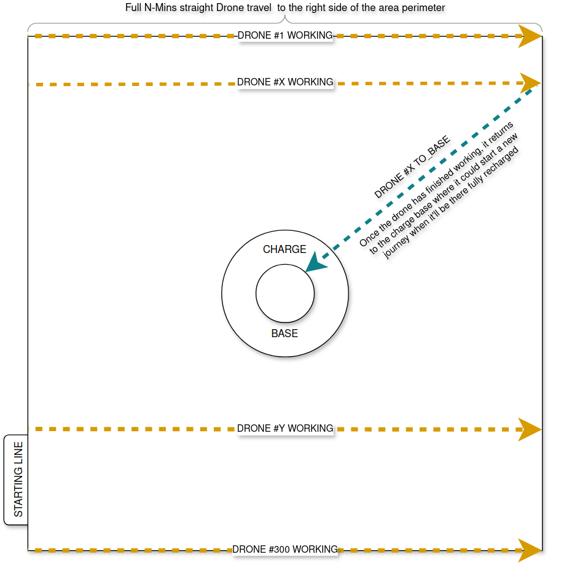

# Drone Control System

## Indice

- [Drone Control System](#drone-control-system)
  - [Indice](#indice)
- [Descrizione generale](#descrizione-generale)
  - [Fini del sistema](#fini-del-sistema)
  - [Modello concettuale ed illustrazione del sistema](#modello-concettuale-ed-illustrazione-del-sistema)
    - [Modello concettuale del sistema](#modello-concettuale-del-sistema)
    - [Struttura dell'area sorvegliata](#struttura-dellarea-sorvegliata)
    - [Stati del sistema](#stati-del-sistema)
    - [Stati di guasto dei droni](#stati-di-guasto-dei-droni)
    - [Visualizzare il sistema](#visualizzare-il-sistema)
      - [Area da sorvegliare](#area-da-sorvegliare)
      - [To starting line](#to-starting-line)
      - [Working](#working)
      - [To base](#to-base)
- [User requirements](#user-requirements)
  - [Use case utente](#use-case-utente)
    - [Use case vista ampia del sistema](#use-case-vista-ampia-del-sistema)
- [System requirements](#system-requirements)
  - [Architectural system diagram](#architectural-system-diagram)
  - [Activity diagram creazione Wave e droni](#activity-diagram-creazione-wave-e-droni)
  - [State diagram Drone](#state-diagram-drone)
  - [Message sequence chart diagram carica Drone](#message-sequence-chart-diagram-carica-drone)
- [Implementation](#implementation)
  - [Implementazione software](#implementazione-software)
  - [_Outsourcing_](#outsourcing)
  - [Implementare il sistema](#implementare-il-sistema)
    - [Componente ChargeBase](#componente-chargebase)
    - [Componente ScannerManager](#componente-scannermanager)
    - [Componente DroneControl](#componente-dronecontrol)
    - [Componente Drone](#componente-drone)
    - [Componente Wave](#componente-wave)
    - [Componente Buffer](#componente-buffer)
    - [Componente Globals](#componente-globals)
    - [Componente Database](#componente-database)
  - [Database e Redis](#database-e-redis)
    - [Schema del Database](#schema-del-database)
      - [Connessione al Database](#connessione-al-database)
      - [Definizione dello Schema della Tabella](#definizione-dello-schema-della-tabella)
      - [Gestione delle Modifiche e Aggiornamenti](#gestione-delle-modifiche-e-aggiornamenti)
    - [Connessioni Redis](#connessioni-redis)
  - [Risultati Sperimentali](#risultati-sperimentali)

## Drone Control System

Drone Control System è un progetto simulante un sistema di sorveglianza basato su droni volanti che monitorano un'area
di $6\times6\,\mathrm{Km}$.

Il sistema è sviluppato come progetto d'esame
per [Ingegneria del software](https://corsidilaurea.uniroma1.it/it/view-course-details/2023/29923/20190322090929/1c0d2a0e-d989-463c-a09a-00b823557edd/8e637351-4a3a-47a1-ab11-dfe4ad47e446/4f7bd2b2-2f8e-4c38-b15f-7f3c310550b6/8bcc378c-9ff1-4263-87b7-04a394485a9f?guid_cv=8e637351-4a3a-47a1-ab11-dfe4ad47e446&current_erogata=1c0d2a0e-d989-463c-a09a-00b823557edd),
corso tenuto dal prof [Enrico Tronci](https://corsidilaurea.uniroma1.it/it/users/enricotronciuniroma1it)
a [La Sapienza](https://www.uniroma1.it/), ed è basato sul progetto gentilmente proposto dal prof nel
main.pdf [qui](https://drive.google.com/drive/folders/15HrKGosqsuBBe8qWCm1qB_PvIbRLohqZ), al punto _4.2 Controllo
formazione droni_.

## Descrizione generale

### Fini del sistema

Il sistema progettato è basato, come detto in apertura, su una delle tracce di progetto fornite dal prof Tronci. La
traccia è la seguente:

> Si progetti il centro di controllo per una formazione di droni che deve sorvegliare un'area di dati. Ogni drone ha
> un'autonomia di $30$ minuti di volo ed impiega un tempo di minimo $2h$ e massimo $3h$ per ricaricarsi. Il tempo di
> ricarica è scelto ad ogni ricarica uniformemente a random nell'intervallo $[2h, 3h]$. Ogni drone si muove alla
> velocità
> di $30 Km/h$. L’area da monitorare misura $6\times6$ Km. Il centro di controllo e ricarica si trova al centro
> dell’area
> da sorvegliare. Il centro di controllo manda istruzioni ai droni in modo da garantire che per ogni punto dell’area
> sorvegliata sia verificato almeno ogni $5$ minuti. Un punto è verificato al tempo $t$ se al tempo $t$ c'è almeno un
> drone a distanza inferiore a $10$ m dal punto. Il progetto deve includere i seguenti componenti:
>
> 1. Un modello (test generator) per i droni
> 2. Un modello per il centro di controllo
> 3. Un DB per i dati (ad esempio, stato di carica dei droni) ed i log
> 4. Monitors per almeno tre proprietà funzionali
> 5. Monitors per almeno due proprietà non-funzionali

Il sistema si occupa quindi di verificare che ogni punto dell'area sia sorvegliato ogni cinque minuti, e, in caso
contrario, segnala eventuali anomalie.

### Modello concettuale ed illustrazione del sistema

#### Modello concettuale del sistema

Il sistema si compone di una **base centrale** (composta da componenti come **ChargeBase**, **DroneControl**, **Scanner**) situata al centro dell'area, che funge da punto di partenza e ricarica per i droni.  
La **ChargeBase** è l'unico punto dell'intera area in cui i droni si trovano in uno stato di **non volo** e gestisce la ricarica di ciascun drone dopo ciascun suo giro di perlustrazione. Più precisamente gli stati di non volo sono due, ossia `CHARGING` e `IDLE`, e il giro di perlustrazione corrisponde allo stato di `WORKING` del drone. Per spiegare come ogni drone adempie alla verifica di ogni punto ogni cinque minuti almeno, vediamo come l'area è concettualmente strutturata.

#### Struttura dell'area sorvegliata

L'area da sorvegliare è un quadrato di $6x6\mathrm{\,Km}$ $(36 \mathrm{\, Km^2})$, suddiviso in una griglia regolare composta da quadrati di lato $20\mathrm{m}$ ciascuno. La griglia ha quindi $300$ righe e $300$ colonne, ed un totale di $90.000$ quadrati.

Partendo dalla richiesta della traccia abbiamo pensato di vedere questi quadrati come delle _celle_ con al proprio centro il punto da verificare per il drone. Quest'ultimo condivide infatti l'istante di tempo $t$ in cui è coperto con ogni altro punto nella cella, facendo sì che al passaggio del drone sul punto al $t$-esimo istante di tempo, l'intera area del quadrato della griglia risulti simultaneamente coperta - dove il tempo è rappresentato, nel nostro sistema, da un'unità di tempo chiamata `tick` (un tick equivale ad un numero preciso di secondi che vedremo dopo).
Chiamiamo quindi `starting_line` la colonna di celle coincidenti col lato sinistro dell'area.

Per far sì che il requisito di sorveglianza di ogni punto almeno ogni $5$ minuti sia rispettato, raggruppiamo i droni in gruppi di $300$ che chiamiamo onde.
Una volta formata l'onda, questa parte dalla base verso la `starting_line`. I droni si muoveranno in diagonale.
Quando ogni drone è arrivato alla starting_line, l'onda parte col sorvegliare l'area. Questo processo si ripete ogni cinque minuti. È importante notare come il momento in cui l'ultimo drone della nuova onda arriva alla `starting_line` coincide col momento in cui l'onda precedente avrà lavorato per esattamente cinque minuti.

Con onde di droni partenti ogni cinque minuti dalla `starting_line`, ogni punto dell'area è verificato almeno ogni cinque minuti: quando un punto sulla linea di quadrati che il drone percorre sarà stato verificato, esso lo sarà di nuovo entro i prossimi cinque minuti grazie al drone della nuova onda che arriverà a sorvegliarlo trascorso il tempo detto.
Questo sistema forma un meccanismo ad onde che è possibile vedere nelle immagini a seguire, in cui nel lifetime di una simulazione è possibile osservare il susseguirsi di diverse onde di droni, ciascuna delle quali copre naturalmente per intero l'area da sinistra a destra.

#### Stati del sistema

Facciamo ora ordine circa gli stati del sistema:

0. **Avvio simulazione**  
   Avviata la simulazione, $300$ droni vengono generati al centro dell'area.

1. **Partenza droni (`TO_STARTING_LINE`)**  
   Carichi al $100\%$, i droni generati scelti da ScannerManager partono dalla `ChargeBase` verso il lato sinistro dell'area, per posizionarsi lungo la `starting_line`. Avremo perciò $300$ droni pronti a partire dal lato sinistro dell'area, uno per ogni quadrato.

2. **Attesa degli altri droni (`READY`)**  
   I droni giunti alla `starting_line` non passano subito a `WORKING`, ma entrano in uno stato di attesa chiamato `READY`, in cui rimangono fin quando ognuno dei $300$ droni non è arrivato alla `starting_line` ed è passato a sua volta a `READY`.

3. **Copertura dell'area (`WORKING`)**  
   Dopo che tutti i droni sono entrati in `READY`, essi entrano nello stato di `WORKING`. Iniziano quindi il loro volo a $30 \mathrm{\,Km}$ in linea retta (parallela alla base dell'area) verso il lato destro del perimetro dell'area, passando sopra ciascun checkpoint (punto) al centro dei 300 quadrati che separano la `starting_line` dal lato destro dell'area. Ogni volta che un drone sorvola un punto, lo verifica, verificando al contempo tutta l'area del quadrato di cui il punto è il centro.

4. **Ritorno alla base (`TO_BASE`)**  
   Quando un drone/onda (possiamo usare i termini in maniera intercambiabile, perché il movimento di un drone è equivalente a quello di un'onda) raggiunge il lato destro dell'area, termina il suo lavoro di verifica dei punti copertura dell'area, e passa allo stato `TO_BASE`. In questo stato non fa altro che tornare verso il **centro** dell'area per ricaricarsi, ed essere riutilizzato in un nuovo viaggio di copertura.

5. **Ricarica droni (`CHARGING`)**  
   Giunti alla base, i droni vengono ricaricati da `ChargeBase`.

6. **Attesa in base (`IDLE`)**  
   A carica completa (e non prima), i droni sono messi a disposizione di ScannerManager per essere riusati nel creare una nuova onda.

#### Stati di guasto dei droni

Durante uno qualsiasi degli stati di volo (`TO_STARTING_LINE`, `READY`, `WORKING`, `TO_BASE`), i droni possono entrare in uno dei seguenti fault state:

- **DEAD**: Il drone subisce un malfunzionamento critico e diventa irrecuperabile.
- **DISCONNECTED**: Il drone perde la connessione e tenta di riconnettersi.
- **HIGH_CONSUMPTION**: Il drone consuma più del previsto e continua a operare fino a quando la carica non si esaurisce.

I droni con stato `DISCONNECTED` possono recuperare la connessione (`RECONNECTED`) tornando quindi allo stato precedente la disconnessione, oppure passare a `DEAD` se la connessione non viene ristabilita.
I droni in `HIGH_CONSUMPTION` possono non riuscire ad arrivare alla base. In tal caso passano allo stato `DEAD`

Si noti che `HIGH_CONSUMPTION` è un "meta-stato", se vogliamo. Infatti nel SUD non compare come uno stato vero e proprio (gli altri, ad esempio, sì, essendo definiti in classi apposite), ma è semplicemente una condizione del drone in uno stato di volo che vede il proprio consumo moltiplicato di un fattore casuale scelto in un range di valori plausibile per uno stato di alto consumo di energia. Lo stesso dicasi per lo stato `IDLE`, che è presente nel sistema in qualità di un insieme contenente i droni carichi e disponibili al riuso.

Ogni fault state è conseguenza di uno scenario attivato dal TestGenerator, che è l'entità adibita alla generazione tramite generatori pseudocasuali di avvenimenti riguardanti l'environment di DroneControlSystem.

#### Visualizzare il sistema

La seguente è una vista ad alto livello dell'area, delle componenti del sistema e di alcune delle fasi in cui sono coinvolte

##### Area da sorvegliare


##### To starting line


##### Working


##### To base



##### Contesto del sistema


## User requirements

Questi sono i requisiti utente che riflettono le esigenze e le aspettative degli utenti del sistema:

- **(1) Area di Sorveglianza**: L’area da monitorare misura $6\times6$ Km.
- **(2) Centro di Controllo e Ricarica**: Il centro di controllo e ricarica si trova al centro dell’area da sorvegliare.
- **(3) Autonomia e ricarica dei droni**: ogni drone ha $30$ minuti di autonomia e deve ricaricarsi in un tempo compreso
  tra le $[2, 3]$ ore

### Use case utente

#### Use case vista ampia del sistema


## System requirements

Questi requisiti sono i requisiti di sistema che dettagliano le specifiche tecniche e le funzionalità necessarie per implementare il sistema:

- **(1.1) Sistema di Copertura dell'Area di Sorveglianza**: Il sistema deve programmare e coordinare i percorsi di volo dei droni per garantire una copertura completa e costante dell'area di sorveglianza di $6\times6$ Km.
- **(1.2) Monitoraggio e Verifica del Territorio**: Il sistema deve assicurare che ogni punto dell'area sia verificato almeno una volta ogni $5$ minuti, monitorando la posizione e l'attività di ciascun drone.
  Un punto è verificato al tempo $t$ se al tempo $t$ c'è almeno un drone a distanza inferiore a $10$ m dal punto
- **(2.1) Implementazione del Centro di Controllo**: Il centro di controllo e ricarica deve essere fisicamente situato
  al centro dell'area da sorvegliare. Il sistema deve essere configurato per utilizzare questa posizione centrale come punto di partenza per la pianificazione delle missioni e per l'ottimizzazione dei percorsi di ritorno per la ricarica.
- **(2.2) Funzionalità del Centro di Controllo**: Il centro di controllo, situato al centro dell'area di sorveglianza, deve gestire tutte le operazioni dei droni, inclusa la pianificazione delle missioni, il monitoraggio in tempo reale e
  la gestione delle emergenze.
- **(3.1) Controllo autonomia dei Droni**: Il sistema deve gestire autonomamente l'autonomia di volo di ciascun drone, coordinando i tempi di rientro per la ricarica basandosi sul livello di carica della batteria.

### Architectural system diagram


### Activity diagram creazione Wave e droni


### State diagram Drone


### Message sequence chart diagram carica Drone


## Implementation

### Implementazione software

Il sistema è implementato in [C++](https://isocpp.org/), e fa uso di [Redis](https://redis.io/) e
di [PostgreSQL](https://www.postgresql.org/).
Redis è disponibile in C++ come client grazie a [redis-plus-plus](https://github.com/sewenew/redis-plus-plus), ed è quello che è stato usato.
Redis è stato usato per gestire i flussi di dati dei thread, compresi quelli dei droni, e per la comunicazione col database PostgreSQL.

### _Outsourcing_

Nell'implementazione del sistema abbiamo cionondimeno considerato l'uso di altre tecnologie di cui esso è altresì composto, quali quelle del:

- sistema di comunicazione wireless droni⇒centro di controllo (e vva.): per trasmettere dati e conferme tra droni e centro di controllo
- sistema GPS: per determinare con precisione la posizione del drone e muoverlo nell'area

Sebbene alcune di queste tecnologie e componenti siano usate nel sistema (come il GPS), la loro implementazione è esterna e relegata a misure di outsourcing.

### Implementare il sistema

Il sistema è strutturato secondo un'architettura modulare che comprende diverse componenti chiave, ciascuna realizzata attraverso file sorgente specifici.

#### Componente ChargeBase

Questa componente è responsabile per la gestione della ricarica dei droni, assicurando che i droni siano pronti per le operazioni di volo secondo le necessità del sistema.

_Pseudocodice di ChargeBase:_

```
class ChargeBase
	[Run] ChargeBase's main execution function
		Create or open 2 semaphores used for sync (sem_sync_cb: recieves GO command, sem_dc: sends tick completed status)
		While simulation is running loop
			Wait for sem_sync semaphore for GO command
			Increase charge for every charging drone [ChargeDrone]
			Check if new Drones need charging [ReadChargeStream]
			Release sem_cb semaphore to comunicate tick completed
			Increase internal tick counter
		End loop

	[ReadChargeStream] Check if new drones need to be charged
		Read every element of "charge_stream" on Redis
		Parse every element read
			Update the local drone data [SetChargeData]
		Trim the stream

	[SetChargeData] Update the local data of a drone
		Use the param of the function to update the drone's data saved in an unordered map
		Calculate the rate of charge for the given drone

	[ChargeDrone] Increase the charge value of a drone by the rate calculated for a tick
		For every charging drone loop
			If charge value < 100% then
				Increase the value by the calculated rate
			Else
				Release the drone [ReleaseDrone]

		Remove the drone from the charging drones container

	[ReleaseDrone] Remove the given charged drone from ChargeBase
		Add on Redis the drone to the set of charged drones
		Add on "scanner_stream" the info that the drones has completed charging process

	[SetChargeRate] Creates the charging speed rate
		Choose randomly the total charging duration (between 2 and 3 hours)
		Calculate the charging rate for a single tick
```

#### Componente ScannerManager

Lo `ScannerManager` coordina le operazioni della flotta di droni, gestendo lo stato di ciascun drone/onda

_Pseudocodice di ScannerManager:_

```
class ScannerManager
	[CheckSpawnWave] Checks whether the DroneControl has sent a command to spawn a new Wave
		Save current time
		While loop
			Get "spawn_wave" value from Redis
			If "spawn_wave" == 1 then
				Decrease the value of "spawn_wave" on Redis
				return True
			End if
			Save elapsed_time since start
			If elapsed_time > timeout value then
				If "spawn_wave" == -1 then
					return False
				return False
			End if
		End loop

	[SpawnWave] Create a new Wave
		Set the wave ID
		Create and add a new Wave to the vector containing all the other Waves
		Enque the Wave's main run function to the pool of threads
		Increase the Wave ID counter

	[Run] ScannerManager's main execution function
		Create the IPC message queue
		Create or open 2 semaphores used for sync (sem_sync_sc: recieves GO command, sem_sc: sends tick completed status)
		Signal the synchronizer to add a new thread to the synch process
		While simulation is running loop
			Wait for sem_sync semaphore for GO command
			If current tick is a multiple of 150 and CheckSpawnWave is true then
				SpawnWave
			End if
			If the number of msg in the IPC queue is > 0 then
				For loop on queue size
					Get the message
					Append the message to the right/indicated Wave

				End loop
			End if
			Signal the synchronizer that current tick is completed
			Release sem_sc semaphore to comunicate tick completed
			Increase internal tick counter
		End loop
		Signal synchronizer to remove a thread from the synch process
		Close sem_sync and sem_dc semaphores
		Close the IPC message queue
```

#### Componente DroneControl

Il modulo `DroneControl` si occupa di impartire le istruzioni operative ai droni, garantendo che ogni area sia monitorata in conformità con i requisiti di progetto.

_Pseudocodice di DroneControl:_

```
class DroneControl
	[ConsumerThreadRun] ConsumerThread main execution function
		While simulation running loop
			Read data from "scanner_stream"
			Parse data from stream
			Write data to DB-Buffer
		End loop

	[WriteDroneDataToDB] DB-Writer thread main execution function
		While max_tick read from DB-Buffer < duration in ticks of simulation
			Read from DB-Buffer the data to write into DB
			Create query string containing the batch of data to write (batch_size = 15000)
				Execute query
			If there are remaining queries
				Execute remaining queries
			Sleep for 1s
		End loop

	[SendWaveSpawnCommand] Send command to ScannerManager to spawn new wave
		Send command to ScannerManager to spawn a new wave (do it by increasing "spawn_wave" value on Redis)
		Wait for the ACK from ScannerManager ("spawn_wave" value = 0)

	[GetDronePaths] Calculate Drone's paths
		Calculate for each of the 300 drones in a wave the set of "working" coords that it will have

	[Run] DroneControl's main execution function
		Create or open 2 semaphores used for sync (sem_sync_dc: recieves GO command, sem_dc: sends tick completed status)
		Calculate paths for working drones
		Create Consumers
			Create Redis consumer group
			Create threads running ConsumerThread main function
			Detach Consumer-Threads
		Create DB-Writer thread
		While simulation is running loop
			Wait for sem_sync semaphore for GO command
			Every 150 ticks SendWaveSpawnCommand
			Release sem_dc semaphore to comunicate tick completed
			Increase internal tick counter
		End loop
		Join DB-Thread if possible
		Close sem_sync and sem_dc semaphores
```

#### Componente Drone

Il `Drone` è un componente fondamentale del sistema e di una Wave (onda), dotato di funzionalità per il volo e la sorveglianza (outsourcing). Ogni drone ha un'autonomia limitata e necessita di ricarica dopo un periodo di attività (working).

_Pseudocodice di Drone:_

```
class Drone
	[Drone] Drone's constructor
		Set current state to ToStartingLine

	[setState] Change current state to the given state
		If currentState != nullptr then
			Execute the exit function of the currentState
		End if
		Set currentState to the given new State

	[Run] Drone's main execution function
		Execute currentState's main run function
		Increase internal tick counter

class DroneState
	class ToStartingLine
		[Run]
			If charge value in the next step is <= 0 then
				setState(Dead)
			End if
			If Drone has reached the starting line then
				setState(Ready)
			Else
				If Drone's next step does reach starting line then
					Set X to -2990
					Set Y to Drone's starting_line.y
					Decrease Drone's charge
				Else
					Move Drone towards the starting line following the direction previously calculated
					Decrease Drone's charge
				End if
			End if

	class Ready
		[Enter]
			Increase Wave's number of ready Drones (# of Drones that reached the starting line)

		[Run]
			If charge value in the next step is <= 0 then
				setState(Dead)
			End if
			If # of ready Drones < 300 then
				Decrease Drone's charge (Wait for all drones to reach the starting line)
			Else
				setState(Working)
			End if

	class Working
		[Run]
			If charge value in the next step is <= 0 then
				setState(Dead)
			End if
			If Drone has reached the right border then
				setState(ToBase)
			Else
				Move Drone to the right by 20m
				Decrease Drone's charge
			End if

	class ToBase
		[Run]
			If charge value in the next step is <= 0 then
				setState(Dead)
			End if
			If Drone has reached Base then
				setState(Charging)
			Else
				If Drone's next step dose reach the Base then
					Set Drone's coords to (0, 0)
					Decrease Drone's charge
				Else
					Move Drone towards the base following the direction previously calculated (inverted on the Y-axis)
					Decrease Drone's charge
				End if
			End if

	class Charging
		[Enter]
			Upload to Redis stream ("charge_stream") Drone's data needed by ChargeBase
			Add DroneID to the vector drones_to_delete

	class Disconnected
		[Enter]
			Create a "hidden" version of coords and charge value
			Save in disconnected_tick the current tick value

		[Run]
		If reconnect_tick != -1 then
			If charge value in the next step is <= 0 then
				setState(Dead)
			End if
			Switch on Drone's previous state
				case ToStartingLine
					Hidden_to_starting_line
				case Ready
					Hidden_ready
				case Working
					Hidden_working
				case ToBase
					Hidden_to_base
			End switch
			If current internal tick >= reconnect_tick + disconnected_tick then
				setState(Reconnected)
			End if
		End if

		[Hidden_to_starting_line]
			If hidden_charge value in the next step is <= 0 then
				setState(Dead)
			End if
			If Drone has reached the starting line then
				Drone's prevous state = Ready
				Increase # of ready drones
			Else
				If Drone's next step does reach starting line then
					Set X to -2990
					Set Y to Drone's starting_line.y
					Decrease Drone's charge
				Else
					Move Drone towards the starting line following the direction previously calculated, using hidden_coords
					Decrease Drone's charge
				End if
			End if

		[Hidden_ready]
			Decrease Drone's charge
			If # of ready Drones < 300 then
				Drone's previous state = Working
			End if

		[Hidden_working]
			Decrease Drone's charge
			Move Drone to the right by 20m using hidden_coords
			If Drone reaches the right border (using hidden_coords) then
				Drone's prevous state = ToBase
			End if

		[Hidden_to_base]
			Decrease Drone's charge
			Move Drone towards the base following the direction previously calculated, using hidden_coords
			If Drone reaches the base then
				setState(Charging)
			End if

	class Reconnected
		[Enter]
			Drone coords = hidden_coords
			Drone charge = hidden_charge

		[Run]
			Switch on Drone's previous state
				case None
					setState(Dead)	#If state is None there was an issue with the drone's execution
				case ToStartingLine
					setState(ToStartingLine)
				case Ready
					setState(Ready)
				case Working
					setState(Working)
				case ToBase
					setState(ToBase)
				case Charging
					setState(Charging)

	class Dead
		[Enter]
			Add DroneID to vector of Drones that need to be deleted
```

#### Componente Wave

Wave si occupa di creare e in parte gestire le operazioni dell'onda di droni che sorveglia l'area.

_Pseudocodice di Wave_

```
class Wave
	[Wave] Wave's contructor
		RecycleDrones
		Set starting internal tick counter
		Set WaveID
		For loop on 300 Wave's drones do
			Create Drone with its data (ID, X, Y, starting_X, starting_Y, tick_drone)
			Calculate drone's direction
		End for
		Self add to "waves_alive" on Redis

	[UploadData] Uploads onto the Redis stream Wave Drone's data
		For each Drone do
			Create stream-ready drone-data
			Add to the pipeline the Redis stream upload function
		End for

	[setDroneFault] Drone fault manager for a given fault
		Calculate the DroneID from WaveID
		Save Drone's current state (into "previous" variable)
		If fault state != NONE then
			Set Drone's state to the given fault state
		End if
		Set Drone's reconnect_tick
		Set Drone's high_consumptio_factor

	[RecycleDrones] Used when creating a new Wave, gets all available fully charged Drones
		Get from Redis DB at most 300 of the fully charged and available drones

	[DeleteDrones] Delete Drones that are dead
		For each DroneID to be deleted do
			Calculate the array index of the Drone
			If Drone hasn't be deleted yet
				Remove Drone from array

	[AllDronesAreDead] Check if all drones of the wave are Dead
		return True if all drones are Dead

	[Run] Wave's main execution function
		Signal the synchronizer to add a new thread to the synch process
		Create a Redis pipeline
		While !AllDronesAreDead loop do
			If the queue for Drone faults is not empty then
				Parse the fault-data from the queue
				setDroneFault
			End if
			For loop on each Drone do
				If Drone != nullptr then
					Execute Drone's Run function
					Create stream-ready drone-data
					Add the Redis stream upload function to the pipeline
				End if
			End for
			Execute Pipeline
			DeleteDrones
			Signal the synchronizer that current tick is completed
			Increase internal tick counter
		End loop
		Remove self from alive Waves on Redis
		Signal synchronizer to remove a thread from the synch process
```

#### Componente Buffer

`Buffer.hpp` è un template utilizzato per la gestione dei dati condivisi tra le componenti del sistema, garantendo il corretto trasferimento di informazioni tra i moduli senza corruzione dei dati.

_Pseudocodice di Buffer:_

```cpp
// CODE
```

#### Componente Globals

I file `globals.h` e `globals.cpp` definiscono variabili, costanti e funzioni ausiliarie utilizzate in più parti del sistema per facilitare l'accesso a informazioni comuni e ridurre la duplicazione del codice.

_Pseudocodice di Globals:_

```cpp
// CODE
```

#### Componente Database

Le operazioni di lettura e scrittura nei log e nel tracciamento dello stato dei droni vengono gestite attraverso il modulo `Database`, che si interfaccia con PostgreSQL, e Redis, che fornisce un sistema di coda e comunicazione in tempo reale.

_Pseudocodice del Database:_

```
class Database
	[ConnectToDB] Creates a connection to "dcs" database
		Make unique connection to "dcs"

	[get_DB] Creates or connects to the "dcs" database
		If "dcs" doesn't exist then
			Create a new "dcs" DB
		ConnectToDB
		If connection to db is open then
			Delete existing tables (drone_logs, monitor_logs, system_performance_logs, drone_charge_logs)
			Create tables (drone_logs, monitor_logs, system_performance_logs, drone_charge_logs)

	[ExecuteQuery] Executes the indicated query
		If connection to DB is open then
			Execute query


class Buffer
	[WriteToBuffer] Writes the indicated vector into the buffer
		Get the lock for thread safety
		Bulk insert the data vector into the buffer

	[ReadFromBuffer] Reads the entire buffer
		Get the lock for thread safety
		Bulk read the entire buffer by saving the data into a vector
		Clear the buffer

	[getSize] Return the size of the buffer
		return Buffer's size

```

### Schema del Database

Analizziamo ora lo schema del database. Questo ci permetterà di fornire una descrizione dettagliata di come i dati vengono memorizzati.

Drone Control System utilizza un database PostgreSQL per memorizzare e gestire i dati relativi all'attività e allo stato dei droni durante le missioni di sorveglianza. La gestione del database è implementata nel file `Database.cpp`, specificamente nella funzione `get_DB()`, che si occupa di stabilire la connessione al database e di configurare lo schema necessario.

#### Connessione al Database

La funzione inizia con la verifica dell'esistenza del database denominato 'dcs'. Se il database non è presente, viene creato utilizzando le credenziali standard:

```cpp
pqxx::connection C("user=postgres password=admin@123 hostaddr=127.0.0.1 port=5432");
pqxx::nontransaction N(C);
pqxx::result R = N.exec("SELECT 1 FROM pg_database WHERE datname='dcs'");
if (R.empty()) {
    pqxx::work W(C);
    W.exec("CREATE DATABASE dcs");
    W.commit();
}
```

User e password sono ovviamente personalizzabili a discrezione dell'utente del sistema.

Una volta assicurata l'esistenza del database, si procede con la connessione specifica al database 'dcs' per iniziare le operazioni di gestione dei dati.

#### Definizione dello Schema della Tabella

La tabella principale utilizzata per registrare i dati dei droni è `drone_logs`. Questa tabella viene definita come segue:

```sql
CREATE TABLE drone_logs (
    tick_n INT,
    drone_id INT NOT NULL,
    status VARCHAR(255),
    charge FLOAT,
    zone VARCHAR(255),  // TODO: Change to int
    x FLOAT,
    y FLOAT,
    checked BOOLEAN,
    CONSTRAINT PK_drone_logs PRIMARY KEY (tick_n, drone_id)
);
```

Questo schema è progettato per registrare informazioni dettagliate per ogni "tick" della simulazione, ovvero ogni unità
di tempo in cui il sistema verifica e aggiorna lo stato dei droni. I campi includono:

- `tick_n`: il numero del tick di simulazione.
- `drone_id`: un identificativo univoco per il drone.
- `status`: lo stato attuale del drone, come "in volo", "in ricarica", etc.
- `charge`: la percentuale di carica rimanente della batteria del drone.
- `zone`: la zona di sorveglianza assegnata al drone.
- `x` e `y`: le coordinate correnti del drone nella zona di sorveglianza.
- `checked`: un booleano che indica se il drone ha verificato un punto specifico nel suo ultimo tick.

#### Gestione delle Modifiche e Aggiornamenti

Se la connessione al database è stata stabilita con successo, la tabella `drone_logs` viene sovrascritta ad ogni avvio
del sistema per garantire che i dati riflettano l'ultimo schema desiderato. Questo approccio permette di aggiornare
facilmente lo schema se necessario per future estensioni o modifiche al sistema.

---

### Connessioni Redis

Le connessioni e le operazioni Redis sono fondamentali per la comunicazione asincrona all'interno del progetto. Il
codice relativo si trova in `ChargeBase.cpp`, `DroneManager.cpp`, e `DroneControl.cpp`, dove è possibile osservare l'uso
pratico dei canali Redis, delle sottoscrizioni e delle pubblicazioni di messaggi.  
La struttura del database e le tabelle sono gestite direttamente tramite query SQL all'interno del codice del progetto,
come si evince dalle richieste di tipo `DatabaseRequest` che includono una query SQL come stringa.  
La classe `Database` fornisce un'interfaccia asincrona per aggiungere richieste di database a un buffer, che poi vengono
processate da un thread dedicato. Questo approccio è utile per ridurre il carico e i tempi di attesa sul thread
principale del programma.

Le operazioni con Redis sono integrate in diverse parti del codice sorgente. Ecco alcuni esempi, nei vari file, delle
operazioni Redis usate:

**DroneControl.cpp:**

- Sincronizzazione con il server Redis utilizzando `utils::SyncWait(redis)`.
- Recupero e verifica dello stato della simulazione tramite `redis.get("sim_running")`.
- Lettura dello stream dei dati per gli aggiornamenti dei droni con `redis.command("XLEN", "drone_stream")`.

**DroneManager.cpp:**

- Attesa sincrona per il Redis server con `utils::SyncWait(shared_redis)`.
- Controllo dello stato della simulazione con `shared_redis.get("sim_running")`.
- Gestione delle zone con comandi come `shared_redis.scard("zones_to_swap")` e `shared_redis.spop("zones_to_swap")`.

**ChargeBase.cpp:**

- Recupero di un'istanza singleton di `ChargeBase` con un riferimento Redis passato al costruttore.
- Verifica dello stato della simulazione con `redis.get("sim_running")`.
- Monitoraggio dello stream di carica con `redis.command("XLEN", "charge_stream")`.
- Lettura e trimming degli stream Redis con comandi come `redis.xread` e `redis.command("XTRIM", ...)`.
- Aggiornamento dello stato del drone nella hash Redis con
  `redis.hset("drone:" + data[0].second, "status", "CHARGING")`.

Quindi, Redis viene utilizzato per mantenere una comunicazione costante tra il centro di controllo e i droni, oltre che
per registrare e recuperare i dati di stato necessari al funzionamento del sistema.

### Risultati Sperimentali

Descrivere i risultati ottenuti dalla simulazione del sistema.
